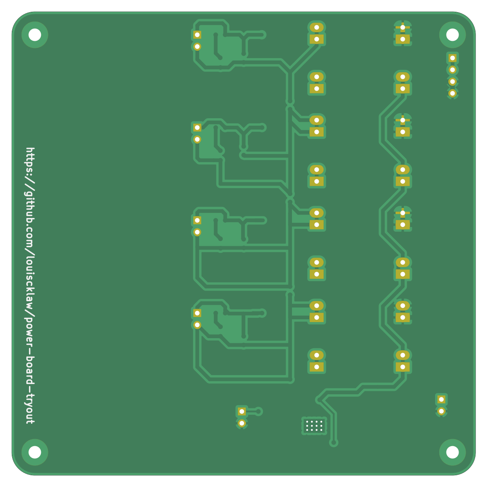

# A Simple PCB for getting various voltage(e.g. 3V3, 5V, 8V etc...) from one voltage source

### Purpose

My power supply capable a single channel voltage source only. If I need another voltage value (e.g. 3V3 on a 12V board). There is no change for me to do so using my power supply. So i create this board to let me get another voltage values(e.g. 3V3, 5V, etc...) from the main power supply (12V).

### PCB outlook

####  This is the front side

####  This is the back side

